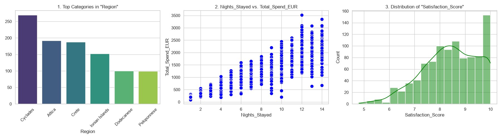

# Autonomous Exploratory Data Analysis Pipeline


## Project Overview
This repository contains an automated, multimodal Exploratory Data Analysis (EDA) pipeline. The system is designed to ingest raw CSV datasets, evaluate data structure and quality, dynamically generate statistical visualizations, and utilize a combination of Large Language Models (LLMs) and Vision AI to synthesize a final analytical briefing. 

The pipeline is built with dynamic schema adaptation, meaning it identifies data domains, variable types, and correlations on the fly without requiring hardcoded parameters.

## System Architecture
The workflow operates through a multi-step orchestration process:
1. **Data Extraction (Pandas):** Parses the dataset, categorizes variable types (numerical vs. categorical), identifies null values, and computes descriptive statistics.
2. **Feature Selection (Gemini JSON Engine):** Evaluates a sample of the data to select the most analytically significant columns for visualization, actively filtering out identifiers or unique codes.
3. **Visualization Generation (Matplotlib & Seaborn):** Constructs statistical visualizations (bar charts, scatter plots, and histograms) based on the algorithmically selected features.
4. **Multimodal Synthesis (Gemini Vision):** Processes the generated visual charts alongside the tabular metadata to output a final, structured business intelligence report.

---

## Example Execution: Greek Hospitality Data
To demonstrate the pipeline's dynamic adaptation, it was tested on an unknown generated dataset containing 1,000 records of Greek boutique hotel bookings.

### Visual Output
The system successfully bypassed booking IDs and selected relevant numerical and categorical variables for plotting.



### Automated Analytical Briefing
*The following is the verbatim output generated by the multimodal model, combining numerical metadata and visual chart analysis:*

> **1. Dataset Scope & Data Integrity**
> * Analyzed 1,000 Greek hospitality booking records across six regions (mean spend €1,169.92 across 7.39 average nights stayed).
> * Excellent overall data integrity with 100% completeness across revenue metrics and a minor 1.5% missing rate isolated to Satisfaction_Score (15 records).
> 
> **2. Key Statistical & Visual Findings**
> * **Regional Concentration:** Cyclades represents the primary volume driver (~270 bookings), outperforming Attica (~190) and Crete (~185), while Dodecanese and Peloponnese lag at ~100 bookings each.
> * **Length-of-Stay Revenue Engine:** Total spend exhibits a direct linear relationship with nights stayed (mean €150.65/night), driving maximum yields (€2,500–€3,520) among long-stay guests (10–14 nights).
> * **High Customer Satisfaction Ceiling:** Guest sentiment is strongly positive with an average score of 8.42/10 (median 8.5) and a pronounced peak of perfect 10.0 ratings (>150 bookings).
> 
> **3. Strategic Leadership Recommendations**
> * **Capitalize on High-Yield Extended Stays:** Implement tailored upsell and long-stay packages in top-performing markets (Cyclades and Crete) to convert average 7-night bookings into high-revenue 10+ night stays.
> * **Address Service Quality Floor:** Investigate operational drivers behind bottom-tier satisfaction scores (<6.0) to protect brand equity while auditing missing survey data collection workflows.

---

## Local Setup & Execution

**1. Clone the repository**
```bash
git clone [https://github.com/cbouzios/ai_eda_pipeline.git](https://github.com/cbouzios/ai_eda_pipeline.git)
cd ai_eda_pipeline
```

**2. Install dependencies**
```bash
pip install pandas matplotlib seaborn google-genai python-dotenv
```

**3. Configure Environment Variables**
Create a `.env` file in the project root and add your Google Gemini API Key:
```env
GEMINI_API_KEY=your_api_key_here
```

**4. Execute the Pipeline**
Open the Jupyter Notebook (`ai_analysis.ipynb`), update the target CSV file variable to your desired dataset, and execute all cells sequentially.